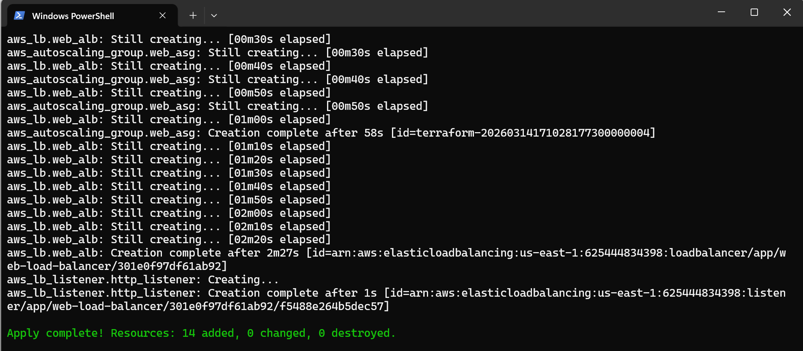
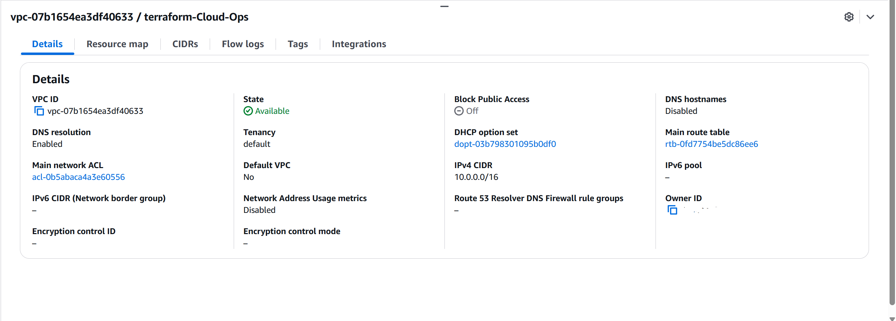
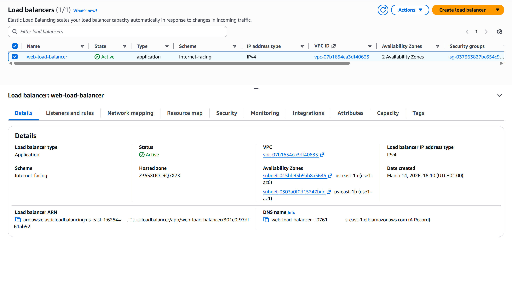
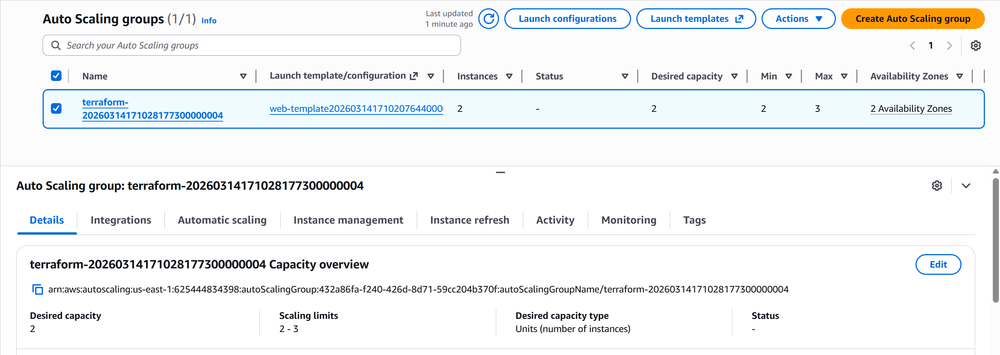
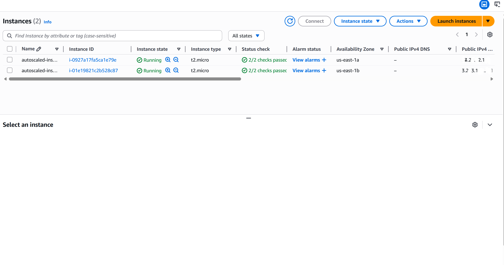
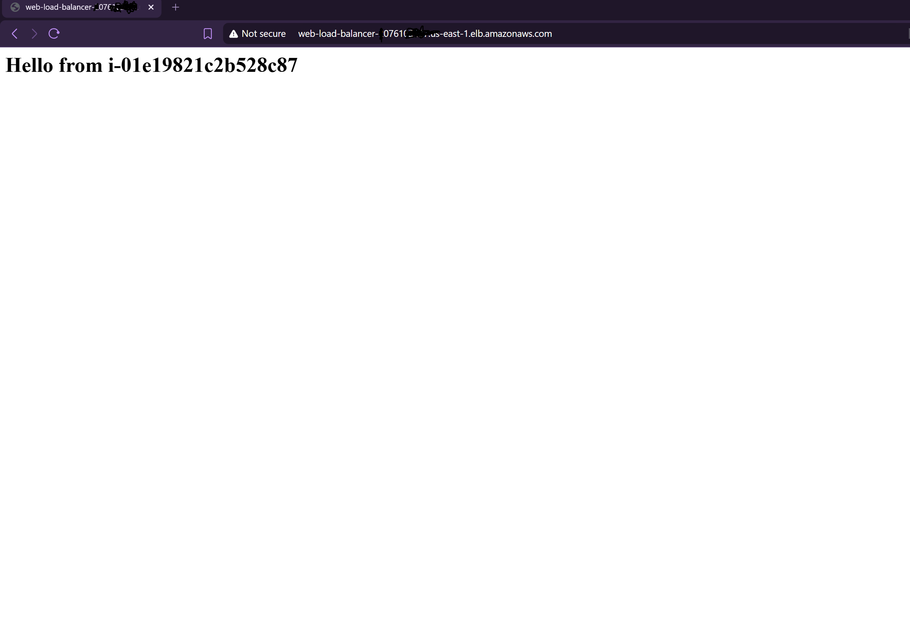

# Terraform AWS ALB + Auto Scaling Web Architecture

A production-style AWS infrastructure built using **Infrastructure as Code (IaC)** with Terraform.

This project provisions a **highly available and scalable web infrastructure** on AWS, using an Application Load Balancer and Auto Scaling Group to distribute traffic across dynamically launched EC2 instances.

The entire infrastructure lifecycle — provisioning, modification, and destruction — is managed declaratively using Terraform.

---

## Technologies Used

- Terraform
- AWS

AWS Services:

- Amazon VPC
- Amazon EC2
- EC2 Auto Scaling
- Application Load Balancer
- Amazon S3 (Terraform Remote State)
- Amazon DynamoDB (Terraform State Locking)

---

## Architecture Overview

This project implements a **high availability architecture pattern commonly used in production cloud environments.**
```
            Internet
                │
                ▼
    Application Load Balancer
                │
                ▼
          Target Group
                │
                ▼
       Auto Scaling Group
                │
    ┌───────────┴───────────┐
    ▼                       ▼
 EC2 Instance           EC2 Instance
(Nginx Web Server)    (Nginx Web Server)
```


### Architecture Highlights

- Incoming traffic is distributed by the Application Load Balancer.
- Auto Scaling Group ensures a fixed number of healthy EC2 instances.
- Instances are automatically replaced if unhealthy.
- Infrastructure is defined and managed entirely through Terraform.
  

---

## Key Infrastructure Features

### Infrastructure as Code

All resources are provisioned using Terraform configuration files.

Benefits include:

- Reproducible infrastructure
- Version controlled environments
- Automated provisioning
- Safer infrastructure changes

---

### Highly Available Web Infrastructure

Traffic is routed through an **Application Load Balancer** which distributes requests across multiple EC2 instances launched by an **Auto Scaling Group**.

This architecture ensures:

- High availability
- Fault tolerance
- Automatic instance recovery

---

### Remote Terraform State

Terraform state is stored remotely in an **S3 bucket**.

Benefits:

- Centralized infrastructure state
- Safer collaboration
- Protection from local machine failures

---

### Terraform State Locking

State locking is implemented using **DynamoDB**.

This prevents multiple Terraform executions from modifying infrastructure simultaneously and protects against state corruption.

---

### Dynamic AMI Selection

Instead of hardcoding AMI IDs, the project uses a Terraform data source to dynamically retrieve the **latest Amazon Linux AMI**.

Benefits:

- Always uses updated machine images
- Improves portability
- Reduces maintenance overhead

---

## Project Structure
```
terraform-aws-alb-autoscaling-webserver

├── backend.tf
├── provider.tf
├── main.tf
├── variables.tf
├── outputs.tf
├── data.tf
├── user-data.sh
├── .terraform.lock.hcl
├── .gitignore
├── README.md
└── screenshots
```


### File Description

| File | Purpose |
|-----|------|
backend.tf | Configures Terraform remote backend |
provider.tf | Defines AWS provider |
main.tf | Core infrastructure resources |
variables.tf | Input variables |
outputs.tf | Terraform outputs |
data.tf | Data sources (latest AMI lookup) |
user-data.sh | EC2 instance bootstrap script |

---

## Deployment Instructions

### 1. Clone Repository
```
git clone https://github.com/Chisom-Eze/terraform-aws-alb-autoscaling-webserve.git
cd terraform-aws-alb-autoscaling-webserver
```
---

### 2. Initialize Terraform

terraform init

---
### 3. Review Infrastructure Plan

terraform plan

---

### 4. Deploy Infrastructure
terraform apply

---

### 5. Destroy Infrastructure
terraform destroy


---

## Terraform Deployment Result

The infrastructure was successfully provisioned using Terraform.

Below is the terminal output confirming that the resources were created.

<p align="center">
  
</p>

## Screenshots

### VPC Configuration

Screenshot showing the configured VPC and subnets.

<p align="center">
  
</p>

---

### Application Load Balancer

Screenshot showing the deployed load balancer and listeners.

<p align="center">
  
</p>

---

### Auto Scaling Group

Screenshot showing instances managed by the Auto Scaling Group.

<p align="center">
  
</p>

---

### EC2 Instances

Screenshot showing running EC2 instances provisioned by Terraform.

<p align="center">
  
</p>

---

### Web Application Response

Accessing the Load Balancer DNS endpoint returns the Nginx welcome page.

<p align="center">
  
</p>
---

## Key Learnings

This project strengthened practical experience in:

- Infrastructure as Code using Terraform
- AWS networking fundamentals
- Load balancing and high availability design
- Terraform remote state management
- Automated infrastructure deployment workflows

---

## Why This Project Matters

Modern cloud infrastructure must be scalable, resilient, and reproducible.

This project demonstrates how Infrastructure as Code can be used to provision a highly available web architecture on AWS using Terraform.

Key engineering principles demonstrated include:

- Infrastructure automation
- High availability design
- Stateless application deployment
- Remote infrastructure state management
- Reproducible cloud environments

---

## Future Improvements

Possible enhancements include:

- Monitoring and alerting with Amazon CloudWatch
- HTTPS using AWS Certificate Manager
- Private subnets with NAT gateways
- CI/CD pipeline for infrastructure deployments
- Infrastructure testing with Terratest

---

## Author
Chisom Eze
```
Cloud engineer focused on designing scalable infrastructure and automation using modern cloud technologies.
```
---

⭐ If you found this project useful, feel free to star the repository.
